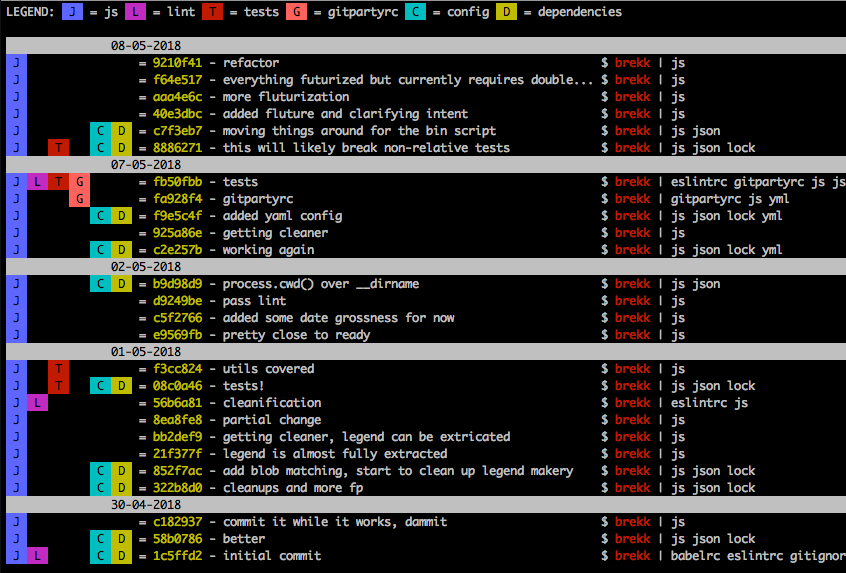

# gitparty

## git log on steroids - see the state of your commits at a glance

Create a `.gitpartyrc` file in a folder that is a git repo.

### .gitpartyrc

```
js:
  key: J
  color: bgBlueBright
  matches:
  - src/*.js
lint:
  key: L
  color: bgMagenta
  matches:
  - \**/.eslintrc
tests:
  key: T
  color: bgRed
  matches:
  - \**/*.spec.js
gitpartyrc:
  key: G
  color: bgRedBright
  matches:
  - \**/.gitpartyrc
config:
  key: C
  color: bgCyan
  matches:
  - \**/package.json
  - \**/rollup/*
  - \**/webpack*
  - \**/^.*
dependencies:
  key: D
  color: bgYellow
  matches:
  - \**/package.json
  - \**/yarn.lock
```

Now you just have to run `gitparty` and you'll get a lovely visual for the state of the repo:



_This module is very much a work-in-progress, feedback welcome._
